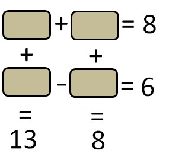
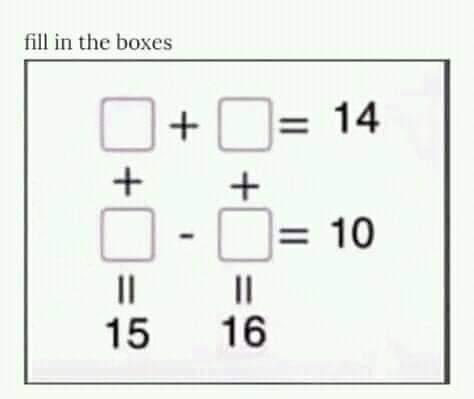
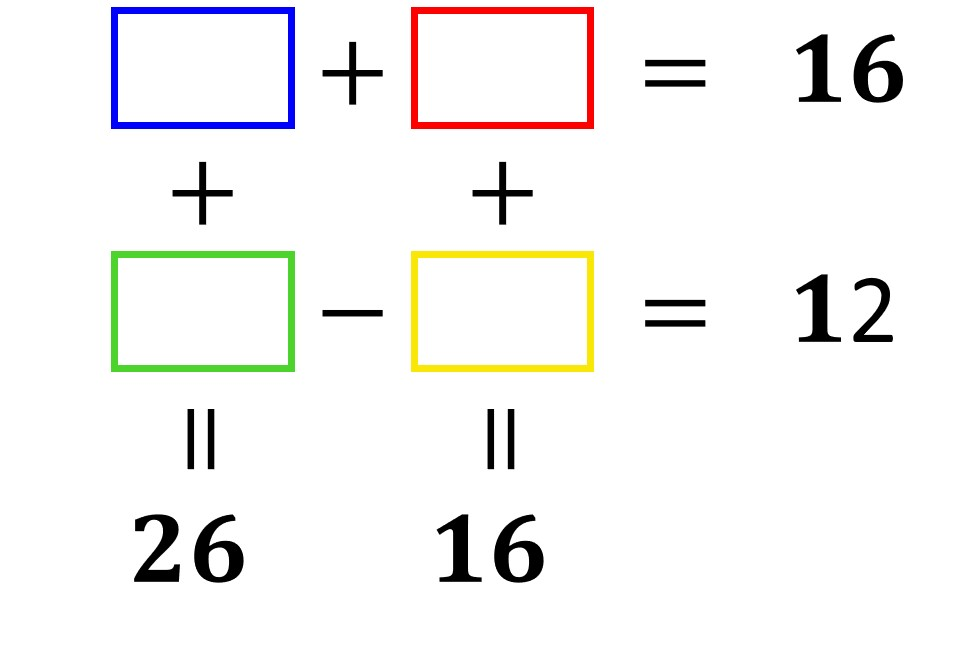

# Maths Box Puzzle Solver
**A simple application to programmatically solve the mathematical box puzzles of the following type. The application allows you to provide the addition/subtraction operations as well as the required answers. Based on the input, it will find an answer if it exists.**

<kbd></kbd>&nbsp;&nbsp;&nbsp;&nbsp;&nbsp;&nbsp;&nbsp;&nbsp;<kbd></kbd>

   

<kbd></kbd>
